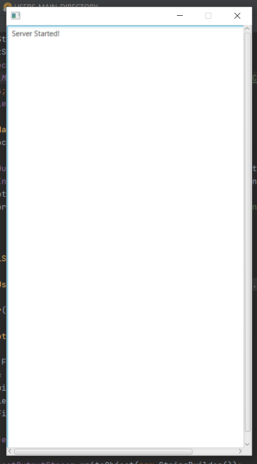
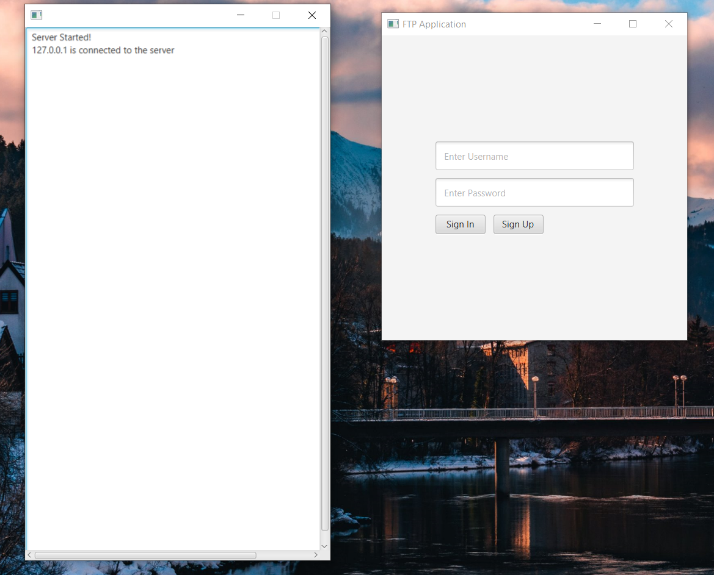
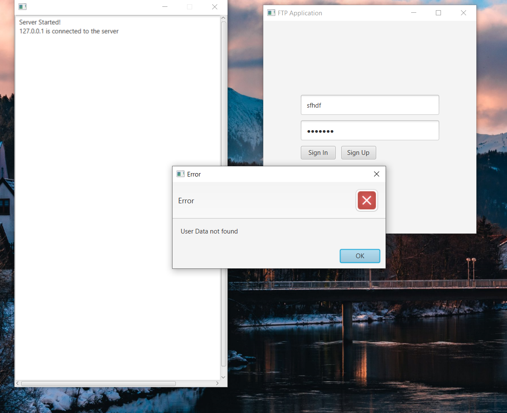
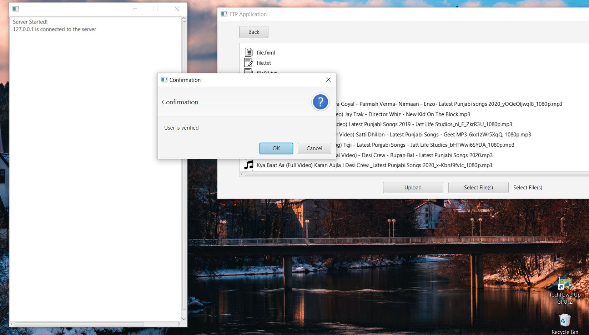
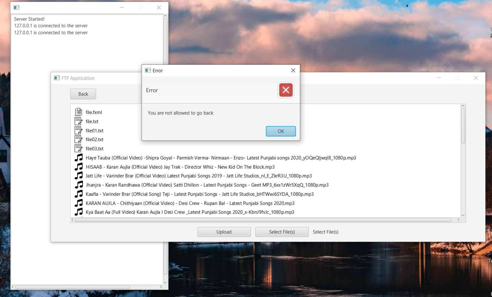
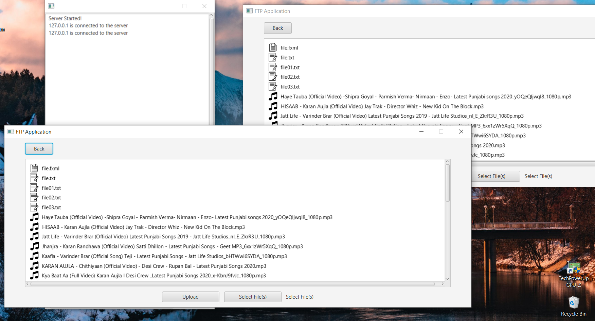
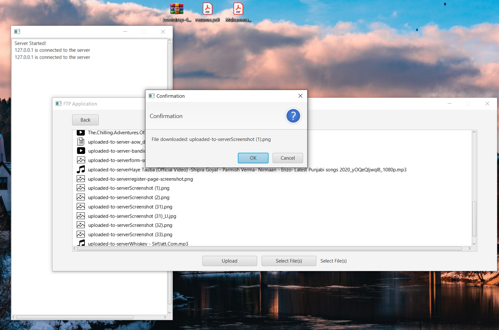
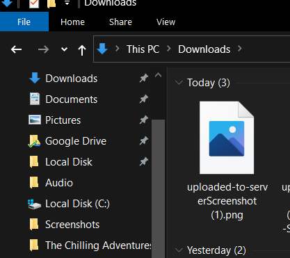

# FTP-Application
**_Any feedback will be highly be appreciated_**
### Video Link
[Youtube Video Link](https://youtu.be/uYjBWZkFm44)

This project was create as an exercise to improve JavaFX and Socket Programming in general.
Application is built on the client server architecture, user can have the listed functionality, all responses come from the server and is displayed to the user. Sign up, and login functionality is achieved using a simple text file, which is read for **signing-in** and updated when **signing-up**

It has the following functionality:
1. User can **sign in**
2. User can **sign up**
3. Can **upload files** to the server, and access them
4. **Download** the files, in the user's _Download Directory (could be any user's)_
5. At a given instance of time, only a certain number of users can connect to the server
6. User is not permitted to access the other directories that is not intended for him
7. If a user is **inactive**, or haven't performed any action for a certain amount of time, it will automatically be disconnected from the server
8. Also supports **multiple clients**
8. For every new connection on the server's end, a **new thread** will be created, to process the client's requests.

### Screenshots

The question for this application:

## Overview

The purpose of this project is to introduce you to the socket programming and construction of networked applications.

You will learn about programming with sockets by implementing a somewhat modified version of the File Transfer Protocol (FTP) for transferring files between two machines. You will implement two programs; a server that listens for incoming connections and provides read and write access to a directory of files, and a client that users can run to connect to the server.

## What to do

You will first write a server program that allows users (clients) to upload and download files to and from a specified directory. After the server has started, it will be in passive mode and listen for the client request. To connect to the server, you must write a client program

Although the project is (hopefully) simple to describe, there are a number of issues that you need to worry about. First, the server must be able to handle multiple client connections (all of which might be active at any given time). Second, the server needs to defend itself from attack and abuse. For example, the server should not allow clients to access forbidden files (such as the system password file), overwrite existing files on uploads, or crash if a client starts misbehaving. In addition, the server needs to properly manage system resources (since the server runs forever, it shouldn't leak memory or file descriptors). Finally, the server should limit the number of simultaneous client connections and automatically disconnect clients that appear to be idle.

Most of the work on this project is focused on the implementation of the server. The client should be relatively easy.

## Programming Task:

You will be writing a server program and client program that speak the according to rules of FTP

Your Server side should have the following functionalities:

1. Create a socket at server side
2. Implement a listening queue to take requests from various clients to be processed by the server.
3. Take requests from listening queue and implement authentication functionality to provide access to the clients.
4. If client enters correct credentials if may proceed to upload a file
5. After getting the file server may proceed to handle another request from listening queue.

Your Client side should have the following functionalities:

6. Create a socket at client side
7. Send request to the server.
8. Now when server is ready to accept the request then client is prompted to enter its details along with passwords.
9. Once the authentication is successfully done then client may send any number of files to the server in one go.
10. After successfully sending file client may terminate or re-request the server to send more files.

You should try to make the client as simple as possible. Most of the work in this assignment is focused on the server.

_More about the client connection: The reliability of the client is far less important than that of the server (consider the reliability of web-browsers compared to web-servers for instance). In particular, it is not necessary for the client to gracefully exit or inform the server that it is done. The server may also decide to simply terminate the client connection (if we have been idle for too long, if there are too many people connected, or if a protocol error occurred). Although protecting the server is clearly more important, one shouldn't completely ignore security on the client._

